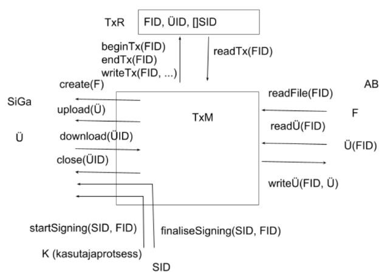

# Üheaegne allkirjastamine

(lahenduse kavand)

Üheaegne allkirjastamine on faili **F** allkirjastamine ühe või enama kasutaja **K1**, ... **Kn** poolt, kasutades Riigi allkirjastamisteenust, nii, et allkirjastamisel on ajaline ühisosa. (Täpsem, formaalne definitsioon ei ole tingimata vajalik, sest mõiste on arusaadav).

Üheaegse allkirjastamise soovitavad omadused:

1. üks allkirjastaja ei pea ootama teise järel.
2. kõik ühele failile antavad allkirjad lähevad ühte ja samasse ümbrikusse.
3. ühe allkirjastamise poolelijäämine või ebaõnnestumine ei sega teisi allkirjastamisi.
4. kohe pärast allkirja andmist süsteemi kasutajaliidesest ümbrikut alla laadides on allkiri ümbrikus.  

Soovitavate omaduste tagamiseks teostame üheaegse allkirjastamise transaktsioonina.
  
## Lahenduse ülevaade

Üheaegse allkirjastamise transaktsioon teostatakse (vt joonis) "transaktsiooniohjuri" (**TxM**) juhtimisel, sidudes "kasutajaprotsesside" (**K1** ... **Kn**), andmebaasi (**AB**), "transaktsioonilao" (**TxR**) ja Riigi allkirjastamisteenuse (**SiGa**) tööd.



## Objektid ja osapooled

- süsteem - Süsteem on teatud äri- v menetlusprotsesse toetav infosüsteem. Süsteem pakub kasutajatele kasutajaliidest. Menetlusprotsesside osana kasutajad allkirjastavad dokumente (faile). 
- **K**    - süsteemi kasutaja ja tema nimel töötav süsteemi komponent v protsess.
- **TxID**    - üheaegse allkirjastamise transaktsiooni identifikaator.
- **AB**    - Andmebaas on süsteemi PostgreSQL andmebaas.
- **F**    - Fail on allkirjastav fail. **F** on salvestatud süsteemi andmebaasis (**AB**).
- **FID**    - on faili **F** identifikaator.
- **Ü** -    Ümbrik on faili *F* ja allkirju sisaldav ümbrik (ingl _container_). Failiga **F** seotakse ainult üks ümbrik.
- **ÜID**    on ümbrikule Riigi allkirjastamisteenuses SiGa antud identifikaator.
- **TxM**    Transaktsiooniohjur on süsteemi serveripoole komponent, mis korraldab üheaegse allkirjastamise. **TxM** suhtleb andmebaasiga (**AB**), transaktsioonilaoga (**TxR**), Riigi allkirjastamisteenusega (**SiGa**) ja kasutajaprotsessidega (**K**). **TxM** töötab klastris, s.t üheaegselt töötab mitu instantsi.
- **SID** -    seansiidentifikaator on kasutaja identifikaator.
- **TxR** -    Transaktsioonikirje on transaktsiooniohjuri **TxM** poolt kasutatav, üheaegse allkirjastamise transaktsiooni **TxID** olekut hoidev andmestruktuur. Transaktsioonikirjet hoitakse  hajusandmebaasis Ignite (alternatiiv: PostgreSQL). Transaktsioonikirje sisaldab (üldjoontes): transaktsiooni identifikaatorit **TxID**, ümbriku indentifikaatorit **ÜID**, üheaegses allkirjastamise osalevate kasutajate identifikaatorid (**SID**-de massiiv).

## Operatsioonid

Üheaegse allkirjastamise transaktsioonis kasutatakse järgmisi (madalama taseme) operatsioone:
- **beginTx(FID)** - transaktsioonikirje **TxR** loomine failile **FID** 
- **endTx(FID)** - transaktsioonikirje kustutamine
- **writeTx(FID, ...)** - transaktsioonikirje täiendamine
- **readTx(FID)** - transaktsioonikirje lugemine

- **create(F)** - seansi loomine **SiGa**-s, faili **F** saatmisega **SiGa**-sse ja ümbriku **Ü**
moodustamisega **SiGa**-s.
- **upload(Ü)** - seansi loomine **SiGa**-s, ümbriku **Ü** saatmisega **SiGa**-sse.
- **download(ÜID)** - ümbriku pärimine **SiGa**-st. 
- **close(ÜID)** - **SiGa**-ga seansi lõpetamine; ümbrik **Ü** **SiGa**-s kustutatakse.

Operatsioonid **AB**-ga
- **readFile(FID)** -    faili **F** (identifikaatoriga **FID**) lugemine süsteemi andmebaasist.
- **readÜ(FID)** - failiga **F** seotud ümbriku **Ü** lugemine süsteemi andmebaasist.
- **writeÜ(FID, Ü)** - ümbriku **Ü** kirjutamine süsteemi andmebaasi.

Ühe allkirja moodustamise voog on siin esitatud üldistatult, kahe "taktina":
- **startSigning(SID, FID)** - allkirjastamisvoo 1. takt
- **finaliseSigning(SID, FID)** - allkirjastamisvoo 2. takt

## Algoritmid

Üheaegse allkirjastamise transaktsioon teostatakse transaktsiooniohjuri **TxM** kolme algoritmiga.

Algoritmides on märgitud kriitilised lõigud. Kriitiline lõik tähendab, et, et lõku tohib täita ainult üks transaktsiooniohjuri lõim. Selleks tuleb lõikus sisalduvad operatsioonid teha Ignite transaktsioonina (https://ignite.apache.org/docs/latest/key-value-api/transactions). 

ALGORITM Allkirjastamise 1. takti (Kasutaja pöördumise **startSigning(SID, FID))** käsitlemine:

````
x - - Kriitiline lõik (Ignite txn) - - - x
IF TxR(FID) ei eksisteeri THEN             # Üheaegse allkirjastamise transaktsioon eksisteerib?
    loo TxR                                # Loo transaktsioonikirje
    IF Ü(FID) eksisteerib THEN             # Ümbrik AB-s eksisteerib?
        readÜ(FID)                         # Loe ümbrik AB-st
        upload(Ü)                          # Saada ümbrik SiGa-sse; loo seanss SiGa-ga
    ELSE
        readFile(FID)                      # Loe fail AB-st
        create(F)                          # Saada fail SiGa-sse; loo seanss SiGa-ga
x - - Kriitilise lõigu lõpp -  - -- - - x
Lisa SID transaktsioonikirjesse TxR        # Märgi kasutaja SID seos transaktsiooniga
Vahenda startSigning operatsioon SiGa-sse        
````

ALGORITM Allkirjastamise 2. takti (Kasutaja pöördumise **finaliseSigning(SID, FID))** käsitlemine:

````
IF TxR(SID, FID) ei eksisteeri THEN         # Allkirjastamise 2. taktiks peab ümbrik
    viga; EXIT                              # juba SiGa-s olema. 
Vahenda finaliseSigning op-n SiGa-sse
download(ÜID)                               # Päri ümbrik SiGa-st
writeÜ(FID, Ü)                              # Kirjuta ümbrik AB-i
Eemalda SID transaktsioonikirjest TxR
x - - Kriitiline lõik (Ignite txn) - - - x
IF SID-e transaktsioonikirjes == 0 THEN     # Viimane allkirjastaja?
    close(ÜID)                              # Lõpeta seanss SiGa-ga
    eemalda TxR                             # Eemalda transaktsioonikirje
x - - Kriitilise lõigu lõpp -  - -- - - x
````

ALGORITM **timeout(TxID)**:

Algoritm **timeout** on vajalik selleks, et lõpetada poolelijäänud allkirjastamised. Kui seejuures selgub, et üheaegse allkirjastamistransaktsiooniga ei ole enam seotud ühtegi kasutajat, siis tuleb transaktsioon lõpetada.

